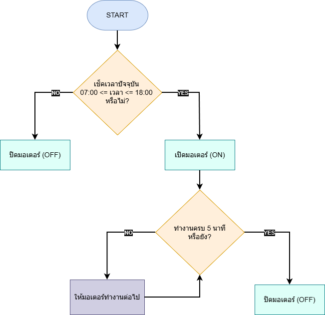
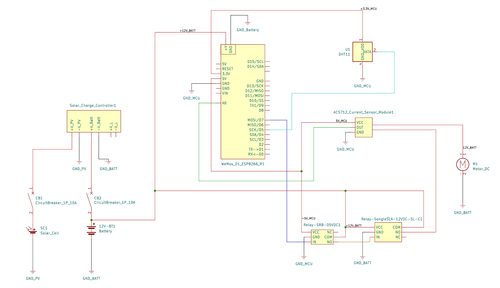

# Solar-Compost-Mixer-499
Source code for a Solar-Powered Dry Leaf Compost Mixer Project 2026

ซอร์สโค้ดระบบควบคุมเครื่องผสมปุ๋ยหมักจากใบไม้แห้งพลังงานแสงอาทิตย์ (Wemos D1 R1, ACS712 & 12V DC Motor)
- ผู้จัดทำ: ธันฐภัทร์ เลิศฤทธิ์
- สาขาวิชา: วิศวกรรมเกษตร คณะวิศวกรรมศาสตร์ กำแพงแสน มหาวิทยาลัยเกษตรศาสตร์

หมายเหตุ: โค้ดชุดนี้เป็นส่วนหนึ่งของโครงงานวิศวกรรมเกษตร สำหรับรายละเอียดของผังวงจร (Wiring Diagram) การตั้งค่า Offset ของเซนเซอร์ และผลการทดสอบประสิทธิภาพเครื่องทั้งหมด สามารถอ้างอิงได้จาก "รูปเล่มโครงงานฉบับสมบูรณ์"

## Overview
ระบบควบคุมการกวนผสมปุ๋ยหมักอัตโนมัติ โดยใช้ ESP8266 เป็นตัวควบคุมฮาร์ดแวร์ (Firmware) และทำงานร่วมกับ Python Backend ในการสั่งการผ่านเครือข่ายไร้สาย (Wi-Fi)

## Hardware Stack
- **Controller:** WeMos D1 R1 (ESP8266)
- **Sensors:** - ACS712 (Current Sensor) - วัดกระแสโหลดมอเตอร์
  - DHT11 (Temp/Humi) - วัดสภาพอากาศภายในกล่องควบคุม
- **Actuator:** Relay Module คุมมอเตอร์กระแสตรง (DC Motor)
- **Power:** Solar Panel + Charge Controller + Battery Backup

## API Engine (For Python Developer)
ตัว Firmware เปิด Web Server ที่พอร์ต 80 เพื่อรับคำสั่ง HTTP Request:
- `GET /api/status` : ดึงข้อมูลสถานะ Relay, กระแส (A), อุณหภูมิ, และความชื้น (JSON)
- `GET /api/on` : สั่งเปิดมอเตอร์ (มีระบบ Safety เช็ก Overcurrent)
- `GET /api/off` : สั่งปิดมอเตอร์

## Software Architecture & Design Pattern
โปรเจกต์นี้ใช้แนวคิด **Decoupled Architecture** แยกส่วนการควบคุม (Hardware Control) ออกจากส่วนตรรกะทางธุรกิจ (Application Logic) เพื่อความเสถียรสูงสุด:
### 1. Hardware Gateway (ESP8266 Firmware)
- **Role:** ทำหน้าที่เป็น "Admin Panel" และ "API Provider"
- **Developer Web UI:** เข้าถึงผ่าน IP Address โดยตรง เพื่อใช้ในการ Debugging, Calibration (Zero Offset), และ Monitor ค่าสถานะแบบ Real-time (เหมาะสำหรับผู้พัฒนาและงานซ่อมบำรุง)
- **API Engine:** เปิด HTTP Endpoints ให้ระบบภายนอก (Python Backend) เข้ามาสั่งการและดึงข้อมูล

### 2. Intelligent Backend (Python Application Backend)
- **Role:** ทำหน้าที่เป็น "The Brain" และ "User Interface"
- **Logic Control:** ควบคุมรอบการทำงาน (Scheduling), บันทึก Log ข้อมูลลงฐานข้อมูล และประมวลผลอัลกอริทึมการหมัก
- **Application:** พัฒนาส่วนติดต่อผู้ใช้งาน (GUI/Dashboard) ให้ใช้ง่ายสำหรับเกษตรกรหรือผู้ใช้ทั่วไป โดยสื่อสารกับบอร์ดผ่านทาง API

## Configuration
ก่อนอัปโหลด Firmware อย่าลืมแก้ค่า Wi-Fi ใน `main.ino`:
```cpp
const char* STA_SSID = "Your_SSID";
const char* STA_PASS = "Your_Password";
```

---

## System Control Logic Flowchart


---

## Hardware & Electrical Design


---

## 🛠️ 1. Mechanical Design & CAD (SolidWorks)

### 1.1 Project Assembly Overview (ภาพรวมการออกแบบ 3 มิติ)

> **คำอธิบาย:** แบบจำลอง 3 มิติ (SolidWorks) แสดงโครงสร้างรวมของเครื่องผสมปุ๋ยหมักใบไม้แห้ง[cite: 4] ประกอบด้วยถังหมักทรงกระบอก โครงเหล็กรับน้ำหนักพร้อมล้อเลื่อน (Caster Wheels) เพื่อความสะดวกในการเคลื่อนย้าย และชุดขับเคลื่อนมอเตอร์ด้านล่าง[cite: 4]

### 1.2 2D Engineering & Assembly Drawing (แบบสั่งขายและมิติขนาด)

> **คำอธิบาย:** แบบเขียนทางวิศวกรรม 2 มิติ (Assembly Drawing) กำหนดขนาดและมิติทางกายภาพ (Dimensions) อย่างแม่นยำ เช่น ความสูงรวม 1,302 mm ความกว้างฐาน 600 mm และเส้นผ่านศูนย์กลางแกนหมุน เพื่อใช้ในการตัดประกอบและเชื่อมขึ้นรูปชิ้นงานจริง (Fabrication)[cite: 5]

### 1.3 Mixing Blade & Shaft Design (การออกแบบแกนกวนและใบผสม)

> **คำอธิบาย:** ชุดแกนหมุนกวนภายในถังหมัก (Agitator Shaft) ออกแบบให้มีใบบิดเอียงทำมุมสลับทิศทาง เพื่อเพิ่มแรงตัดและตักกลับใบไม้แห้ง ทำให้ปุ๋ยหมักผสมเข้ากันได้อย่างทั่วถึงและลดภาระภาระโหลดของมอเตอร์[cite: 10]

### 1.4 Drive System Layout & Adjustment Rails (ระบบขับเคลื่อนและแท่นปรับสไลด์)
| มุมมองด้านบน (Top View) | มุมมองไอโซเมตริก (Isometric View) |
| :---: | :---: |
|  |  |

> **คำอธิบาย:** การจัดวางชุดเกียร์ทดรอบ (Worm Gear Reducer) และมอเตอร์บนแท่นยึดแบบเจาะรูสไลด์ (Slotted Base Plate)[cite: 7, 11] ช่วยให้สามารถปรับระยะตำแหน่งมอเตอร์ เพื่อตั้งความตึงของสายพาน/โซ่ส่งกำลังได้อย่างสะดวก[cite: 7, 8, 11]

---


