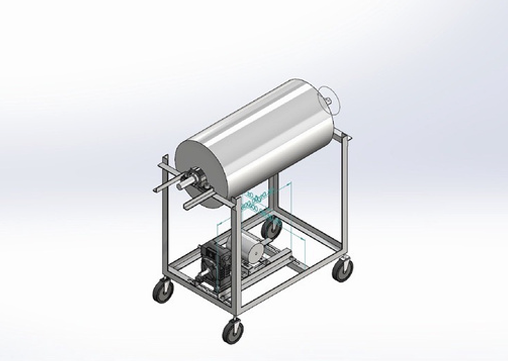
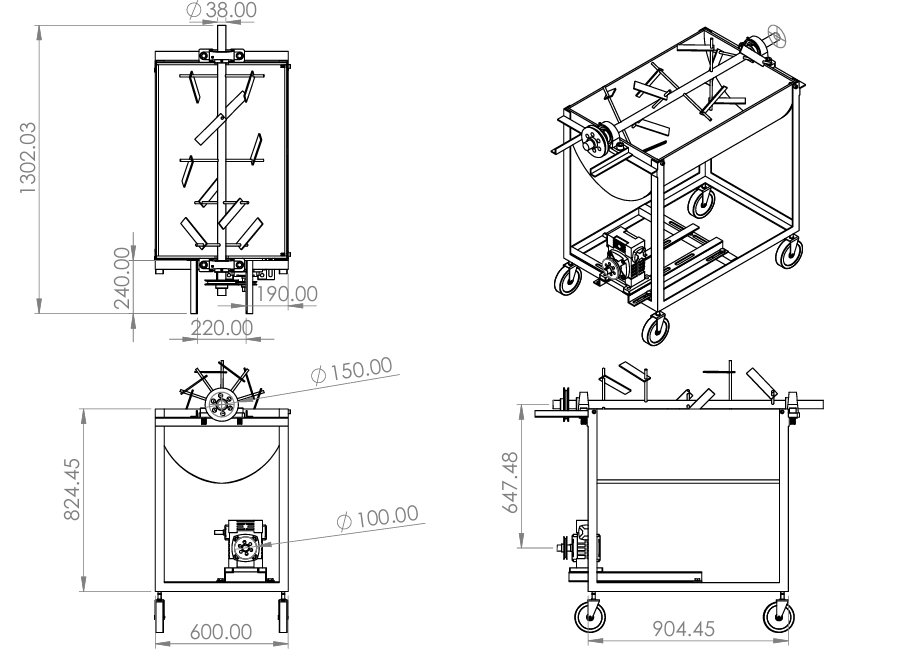
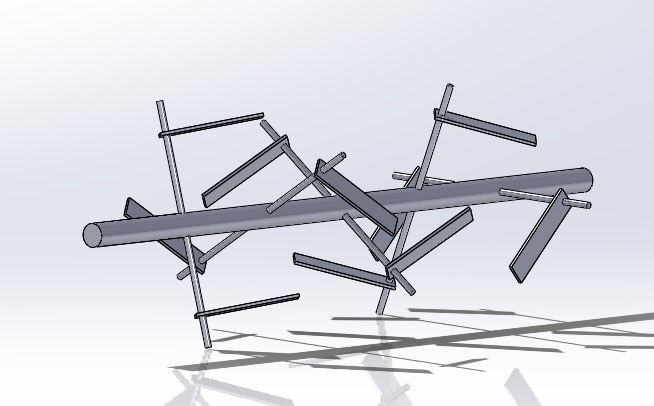
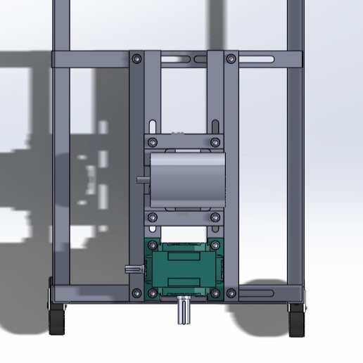
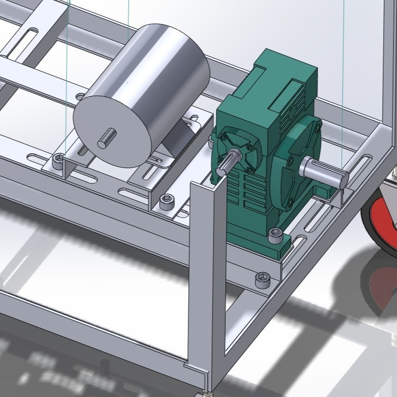

# Solar-Compost-Mixer-499
> **Solar-Powered Dry Leaf Compost Mixer Control System (2026)**
> *โครงการออกแบบและพัฒนาระบบควบคุมเครื่องผสมปุ๋ยหมักจากใบไม้แห้งพลังงานแสงอาทิตย์ (Mechanical CAD, Power Electronics & Decoupled IoT Firmware)*

---

## Project Developer & Info
* **ผู้จัดทำ:** ธันฐภัทร์ เลิศฤทธิ์ (Tantapat Lertrit)
* **สาขาวิชา:** วิศวกรรมเกษตร คณะวิศวกรรมศาสตร์ กำแพงแสน มหาวิทยาลัยเกษตรศาสตร์
* **บทบาทหน้าที่:** R&D Engineer / Mechanical & Control System Designer

---

## Key Highlights 
* **Full-Scale Mechanical CAD:** ออกแบบโครงสร้างกลไก 3D & 2D Assembly Drawing เต็มระบบด้วย SolidWorks
* **Solar Power & Hardware Integration:** บูรณาการระบบไฟฟ้าย่อยพลังงานแสงอาทิตย์ 12V DC ร่วมกับเซนเซอร์วัดกระแสและระบบป้องกัน Overcurrent
* **Decoupled Architecture:** แยกส่วนฮาร์ดแวร์ (ESP8266 REST API) และซอฟต์แวร์ประมวลผล (Python Backend) เพื่อความเสถียร ปลอดภัย และขยายระบบได้ง่าย
* **Safety & Monitoring System:** ระบบมอนิเตอร์กระแสโหลดมอเตอร์และสภาพอากาศภายในแบบ Real-time พร้อมตัดการทำงานอัตโนมัติเมื่อเกิดความผิดปกติ

---

## Tech Stack & Skills Demonstration
| Domain | Technologies & Tools Used |
| :--- | :--- |
| **Mechanical Engineering** | SolidWorks (3D Modeling, Assembly, 2D Drawing), Component Layout, Machine Design |
| **Hardware & Power Electronics** | WeMos D1 R1 (ESP8266), ACS712 Current Sensor, DHT11 Sensor, 12V DC Motor, Relay Module, Solar Panel, Charge Controller |
| **Embedded Firmware** | C/C++ (Arduino Framework), Embedded Web Server, RESTful API Endpoints |
| **Software Architecture** | Python Backend, Decoupled Architecture, HTTP Communication, Data Logging |

---

## 1. Software Architecture & API Design

โปรเจกต์นี้ใช้แนวคิด **Decoupled Architecture** แยกส่วนการควบคุมระดับฮาร์ดแวร์ออกจากตรรกะทางธุรกิจ (Business Logic) เพื่อความเสถียรสูงสุด:

### 1.1 Hardware Gateway (ESP8266 Firmware)
* **Role:** ทำหน้าที่เป็น Administrator Panel และ API Provider
* **Developer Web UI:** เข้าถึงผ่าน IP Address เพื่อใช้ในการ Debugging, Calibration (Zero Offset), และ Real-time Monitoring
* **RESTful API Engine (Port 80):**
  * `GET /api/status` : ดึงข้อมูลสถานะ Relay, ค่ากระแส (A), อุณหภูมิ และความชื้น (รูปแบบ JSON)
  * `GET /api/on` : สั่งเปิดมอเตอร์ (พร้อมระบบ Safety ตรวจสอบ Overcurrent)
  * `GET /api/off` : สั่งปิดมอเตอร์

### 1.2 Intelligent Backend (Python Application)
* **Role:** ทำหน้าที่เป็นส่วนประมวลผลหลัก (The Brain) และส่วนติดต่อผู้ใช้งาน (UI)
* **Logic & Application:** ควบคุมรอบการทำงาน (Scheduling), บันทึก Log ลงฐานข้อมูล และประมวลผลอัลกอริทึมการหมักผ่านการสื่อสารทาง API

### 1.3 System Control Logic Flowchart

> **คำอธิบาย:** แผนผังลอจิกการทำงานของเฟิร์มแวร์ โดยระบบจะตรวจสอบช่วงเวลา (07:00 - 18:00 น.) และควบคุมการเปิดมอเตอร์กวนเป็นรอบ รอบละ 5 นาที เพื่อประหยัดพลังงานแบตเตอรี่ พร้อมระบบ Safety เช็กกระแสโหลด

---

## 2. Hardware & Electrical Design

### 2.1 Circuit Schematic & Wiring Diagram

> **คำอธิบาย:** แผนผังวงจรไฟฟ้าและการต่อพ่วงฮาร์ดแวร์ แสดงการจ่ายพลังงานจากชุดโซลาร์เซลล์และแบตเตอรี่ 12V ผ่าน Solar Charge Controller ไปยังบอร์ด WeMos D1 R1, เซนเซอร์ ACS712, DHT11 และวงจรขับมอเตอร์ DC ผ่าน Relay

---

## 3. Mechanical Design & CAD (SolidWorks)

### 3.1 Project Assembly Overview (ภาพรวมการออกแบบ 3 มิติ)

> **คำอธิบาย:** แบบจำลอง 3 มิติ (SolidWorks) แสดงโครงสร้างรวมของเครื่องผสมปุ๋ยหมักใบไม้แห้ง ประกอบด้วยถังหมักทรงกระบอก โครงเหล็กรับน้ำหนักพร้อมล้อเลื่อน (Caster Wheels) และชุดขับเคลื่อนมอเตอร์ด้านล่าง

### 3.2 2D Engineering & Assembly Drawing (แบบสั่งขายและมิติขนาด)

> **คำอธิบาย:** แบบเขียนทางวิศวกรรม 2 มิติ (Assembly Drawing) กำหนดขนาดมิติทางกายภาพ (Dimensions) อย่างแม่นยำสำหรับการตัดประกอบและเชื่อมขึ้นรูปชิ้นงานจริง (Fabrication) เช่น ความสูงรวม 1,302 mm และความกว้างฐาน 600 mm

### 3.3 Mixing Blade & Shaft Design (การออกแบบแกนกวนและใบผสม)

> **คำอธิบาย:** ชุดแกนหมุนกวนภายในถังหมัก (Agitator Shaft) ออกแบบให้ใบบิดเอียงทำมุมสลับทิศทาง เพื่อเพิ่มแรงตัดและตักกลับใบไม้แห้ง ทำให้ผสมเข้ากันทั่วถึงและลดภาระโหลดของมอเตอร์

### 3.4 Drive System Layout & Adjustment Rails (ระบบขับเคลื่อนและแท่นปรับสไลด์)
| มุมมองด้านบน (Top View) | มุมมองไอโซเมตริก (Isometric View) |
| :---: | :---: |
|  |  |

> **คำอธิบาย:** การจัดวางชุดเกียร์ทดรอบ (Worm Gear Reducer) และมอเตอร์บนแท่นยึดแบบเจาะรูสไลด์ (Slotted Base Plate) ช่วยให้สามารถปรับระยะตำแหน่งมอเตอร์ เพื่อตั้งความตึงของสายพาน/โซ่ส่งกำลังได้อย่างสะดวก

---

## 4. Configuration & Setup

ก่อนอัปโหลด Firmware ลงบอร์ด WeMos D1 R1 ให้ตั้งค่า Wi-Fi ในไฟล์ `main.ino`:
```cpp
const char* STA_SSID = "Your_SSID";
const char* STA_PASS = "Your_Password";
